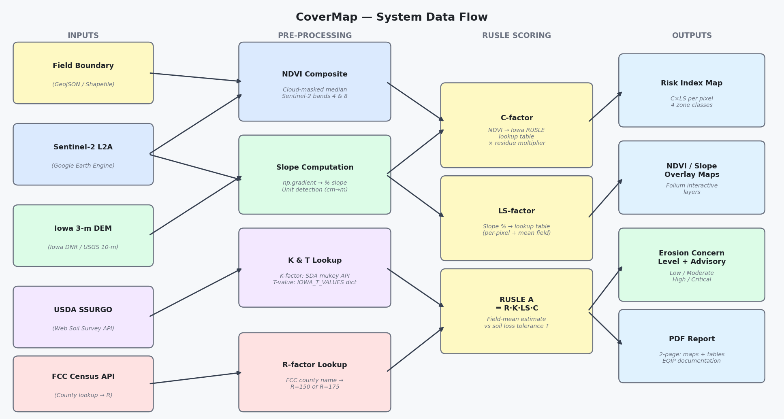
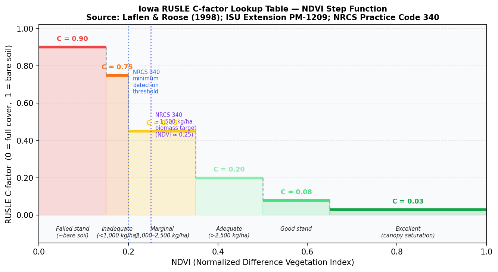
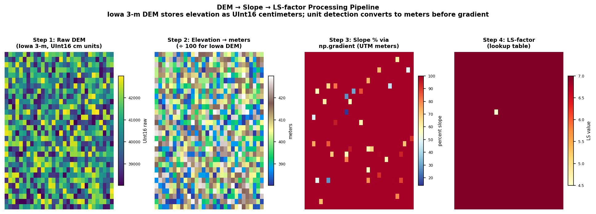
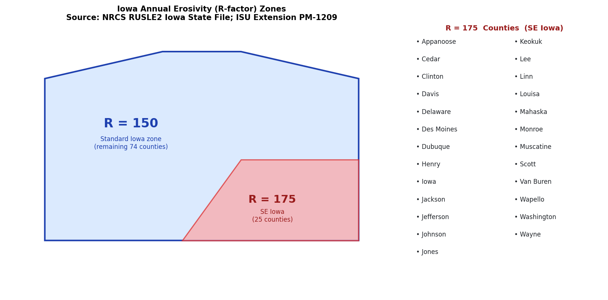
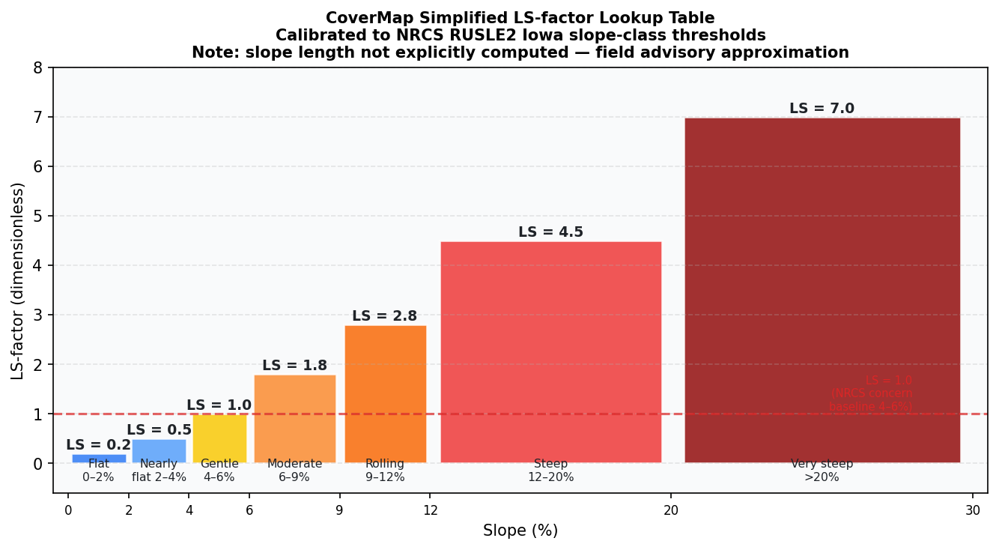
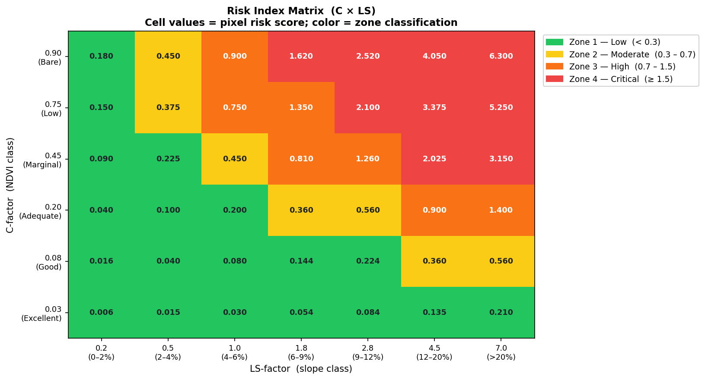
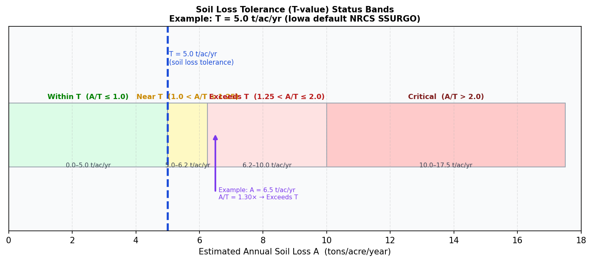

# CoverMap — Technical Reference Document

**Version:** 1.0 | **Date:** April 2026  
**Author:** Stephen Zimmerman, CCA MS — Ag Research Scientist, Ankeny IA  
**Application:** Cover Crop Erosion Risk Viewer (CoverMap)  
**Audience:** Certified Crop Advisers, NRCS Field Staff, Agricultural Engineers

---

## Table of Contents

1. [System Overview](#1-system-overview)
2. [Input Data Sources](#2-input-data-sources)
3. [NDVI Processing](#3-ndvi-processing)
4. [Terrain Analysis](#4-terrain-analysis)
5. [RUSLE Framework](#5-rusle-framework)
6. [Pixel-Level Risk Index (C × LS)](#6-pixel-level-risk-index-c--ls)
7. [Field-Level Erosion Concern Scoring](#7-field-level-erosion-concern-scoring)
8. [Soil Loss Estimation vs. Tolerance (T)](#8-soil-loss-estimation-vs-tolerance-t)
9. [Residue Adjustment Multipliers](#9-residue-adjustment-multipliers)
10. [Iowa R-factor Zone Lookup](#10-iowa-r-factor-zone-lookup)
11. [Output Products](#11-output-products)
12. [Limitations and Caveats](#12-limitations-and-caveats)
13. [References](#13-references)

---

## 1. System Overview

CoverMap is a Streamlit web application that fuses satellite-derived vegetation indices with terrain analysis to produce spatially explicit erosion risk assessments for Iowa agricultural fields. The primary use case is EQIP pre-verification documentation for cover crop practice (NRCS Practice Code 340), though the output is designed for any CCA field advisory workflow.

The analytical engine implements a simplified, spatially distributed form of the **Revised Universal Soil Loss Equation (RUSLE)**:

$$\boxed{A = R \times K \times LS \times C \times P}$$

where:

| Symbol | Factor | Units | Source in CoverMap |
|--------|--------|-------|--------------------|
| **A** | Predicted annual soil loss | tons/acre/year | Computed output |
| **R** | Rainfall erosivity index | MJ·mm / ha·hr·yr | Iowa county zone lookup |
| **K** | Soil erodibility factor | ton·hr / MJ·mm | USDA SSURGO Web Soil Survey |
| **LS** | Slope length and steepness factor | dimensionless | Computed from DEM |
| **C** | Cover-management factor | dimensionless | NDVI → Iowa lookup table |
| **P** | Conservation practice factor | dimensionless | Fixed at **1.0** (no adjustment) |

**Figure 1** shows the complete data flow from inputs through processing to output products.


*Figure 1. CoverMap system architecture. Inputs (left) are processed into RUSLE factor arrays (center), combined into Risk Index scores (right), and rendered as maps and PDF reports.*

---

## 2. Input Data Sources

### 2.1 Field Boundary

**Type:** Vector polygon (GeoJSON or Shapefile)  
**Provided by:** Operator / CCA  
**Use:** All raster data are clipped to the field boundary using `rasterio.mask`. The boundary CRS is reprojected to match each raster source as needed. The field centroid (EPSG:4326) is used for Iowa county lookup.

### 2.2 Sentinel-2 Multispectral Imagery

**Source:** Google Earth Engine (GEE) — Sentinel-2 Level-2A surface reflectance  
**Spatial resolution:** 10 m  
**Temporal composite:** Cloud-masked median over a user-specified date range  
**Bands used:**
- Band 4 (Red, 665 nm)
- Band 8 (Near-Infrared, 842 nm)

$$\text{NDVI} = \frac{\rho_{NIR} - \rho_{Red}}{\rho_{NIR} + \rho_{Red}} = \frac{B8 - B4}{B8 + B4}$$

NDVI ranges from –1.0 to +1.0. For agricultural cover crops in Iowa, effective green-cover detection begins at NDVI ≈ 0.20 under early-spring cloud conditions at 10 m resolution (Myneni et al., 1994; Gitelson & Merzlyak, 1996).

**Scene metadata retained:**
- Earliest and latest scene dates in composite
- Scene count (single-scene flagged as elevated cloud risk)
- Valid pixel percentage within field boundary

### 2.3 Iowa 3-Meter Digital Elevation Model

**Primary source:** Iowa Geospatial Data Clearinghouse — Iowa 3-m LiDAR DEM  
**Fallback source:** USGS 3DEP 10-m National Elevation Dataset  
**Format:** GeoTIFF, UInt16  
**Coordinate system:** Iowa Lambert / UTM Zone 15N (EPSG:26915 after reprojection)  
**Critical detail — elevation units:** The Iowa 3-m DEM stores elevation values as **centimeters** in a UInt16 array (typical field values: 38,000–43,000 representing 380–430 m elevation). An automatic unit-detection routine converts to meters before slope computation.

### 2.4 USDA SSURGO Soil Data

**Source:** USDA Soil Data Access (SDA) Web Service — `SDA_Get_Mukey_from_intersection_with_WktWgs84`  
**Data retrieved:**
- Dominant map unit key (mukey)
- Dominant soil series name
- K-factor (soil erodibility, RUSLE)

**API endpoint pattern:**
```
https://sdmdataaccess.sc.egov.usda.gov/Tabular/SDMTabularService.asmx
```

K-factor values typically range from 0.10 (sandy, erosion-resistant) to 0.64 (silty clay loam, highly erodible) for Iowa soils (Wischmeier & Smith, 1978).

### 2.5 FCC Census Block API (County Lookup)

**Source:** Federal Communications Commission GeoAPI  
**Endpoint:** `https://geo.fcc.gov/api/census/block/find?latitude=&longitude=&format=json`  
**Use:** Returns county name from field centroid coordinates, used to assign Iowa R-factor zone (R=150 or R=175).

---

## 3. NDVI Processing

### 3.1 NDVI to C-factor Lookup

The C-factor (cover-management factor) quantifies the ratio of soil loss from a cropped field to soil loss from a tilled, bare field under identical conditions. For cover crops, C-factor is derived from NDVI using an Iowa-calibrated step-function lookup table.

$$C = f(\text{NDVI})$$

**Table 1. Iowa RUSLE C-factor Lookup Table**

| NDVI Range | C-factor | Stand Condition | Estimated Biomass | Agronomic Interpretation |
|------------|----------|-----------------|-------------------|--------------------------|
| 0.00 – 0.15 | **0.90** | Failed stand | < 500 kg/ha | Essentially bare soil — maximum erosion risk |
| 0.15 – 0.20 | **0.75** | Inadequate | < 1,000 kg/ha | Below NRCS 340 minimum — reseed candidate |
| 0.20 – 0.35 | **0.45** | Marginal | 1,000 – 2,500 kg/ha | Borderline for NRCS Practice Code 340 |
| 0.35 – 0.50 | **0.20** | Adequate | > 2,500 kg/ha | Meets NRCS minimum stand requirement |
| 0.50 – 0.65 | **0.08** | Good stand | 3,000 – 5,000 kg/ha | Strong erosion protection |
| 0.65 – 1.00 | **0.03** | Excellent | > 5,000 kg/ha | Near canopy saturation — minimal erosion |

*Source: Laflen & Roose (1998); ISU Extension PM-1209; calibrated to national cereal rye database mean biomass of 3,428 kg/ha and NRCS Practice Code 340 minimum of ~1,500 kg/ha at NDVI ≈ 0.25.*


*Figure 2. Iowa RUSLE C-factor step function. Each horizontal segment represents one lookup bin. The NRCS Practice Code 340 minimum detection threshold (NDVI = 0.20) and biomass target (NDVI ≈ 0.25, ~1,500 kg/ha) are marked.*

### 3.2 Biomass Proxy

CoverMap estimates above-ground biomass as a linear NDVI proxy for EQIP documentation. This is an approximation only (±40%) and is not a substitute for gravimetric field measurement:

$$\text{Biomass}_{kg/ha} = \max\left(0,\ \frac{\text{NDVI} - 0.10}{0.40} \times 3500\right)$$

Converted to lb/acre: multiply by 0.891.

---

## 4. Terrain Analysis

### 4.1 Elevation Unit Auto-Detection

Because the Iowa 3-m DEM stores values as UInt16 centimeters, CoverMap includes automatic unit detection before computing slope:

```
mean_value > 10,000  →  centimeters  (÷ 100 to get meters)
mean_value > 1,000   →  decimeters   (÷ 10 to get meters)
else                 →  meters       (no conversion)
```

Iowa elevations typically range 150–600 m. A raw UInt16 mean near 38,000–43,000 unambiguously indicates centimeter storage.

### 4.2 Slope Computation

Slope is computed using NumPy's finite-difference gradient in UTM meter coordinates (EPSG:26915), which ensures gradient units are dimensionless (m/m) before conversion to percent:

$$\frac{\partial z}{\partial x},\ \frac{\partial z}{\partial y} = \texttt{np.gradient}(\text{elev\_m},\ \Delta x,\ \Delta y)$$

$$\text{Slope (\%)} = \sqrt{\left(\frac{\partial z}{\partial x}\right)^2 + \left(\frac{\partial z}{\partial y}\right)^2} \times 100$$

where $\Delta x$ and $\Delta y$ are the pixel dimensions in **meters** from the raster affine transform. The result is clipped to [0, 100]% to remove physically unrealistic gradient spikes at nodata boundaries.

**Figure 7** shows the four-step pipeline from raw DEM values to LS-factor.


*Figure 7. DEM processing pipeline. Step 1: raw UInt16 centimeter values. Step 2: converted to meters. Step 3: slope percent via np.gradient in UTM meter space. Step 4: LS-factor via lookup table.*

### 4.3 NaN/Nodata Handling

Iowa DEM nodata is stored as `0` (not the standard GDAL nodata sentinel). CoverMap sets `elev[elev == 0] = NaN` before gradient computation. NaN border pixels are filled with the field-mean elevation before `np.gradient` to avoid edge artifacts, then restored to NaN in the output slope array.

---

## 5. RUSLE Framework

### 5.1 The Full Equation

$$A = R \times K \times LS \times C \times P$$

CoverMap fixes **P = 1.0** (no conservation practice factor) as a conservative default appropriate for documentation of current conditions before any additional structural practice is applied.

### 5.2 R-factor — Iowa Rainfall Erosivity

The R-factor quantifies the erosive potential of rainfall events over a year. Iowa is divided into two zones based on the NRCS RUSLE2 Iowa State File:

| Zone | R-factor | Counties (25) |
|------|----------|---------------|
| Southeast Iowa | **175** MJ·mm/ha·hr·yr | Appanoose, Cedar, Clinton, Davis, Des Moines, Delaware, Dubuque, Henry, Iowa, Jackson, Jefferson, Johnson, Jones, Keokuk, Lee, Linn, Louisa, Mahaska, Monroe, Muscatine, Scott, Van Buren, Wapello, Washington, Wayne |
| Remainder of Iowa | **150** MJ·mm/ha·hr·yr | All other counties |

The higher R-factor in southeastern Iowa reflects greater storm intensity and annual precipitation from Gulf of Mexico moisture systems (Wischmeier & Smith, 1978; NRCS RUSLE2 Iowa State File).

**County lookup method:** Field centroid (EPSG:4326) → FCC Census Block API → county name string match → R assignment. Falls back to R=150 if the API is unavailable.


*Figure 5. Iowa R-factor zones. Southeast Iowa (25 counties, red) uses R=175; the remaining 74 counties use R=150. County assignment is automated via FCC Census Block API from field centroid coordinates.*

### 5.3 K-factor — Soil Erodibility

The K-factor reflects inherent soil susceptibility to detachment and transport by rainfall and runoff. It integrates texture, organic matter, structure, and permeability:

$$K = f(\text{texture},\ \text{organic matter},\ \text{structure},\ \text{permeability})$$

Typical Iowa values (Wischmeier & Smith, 1978; Schwab et al., 1993):

| Soil Type | K-factor Range | Common Iowa Series |
|-----------|---------------|-------------------|
| Sandy loam | 0.10 – 0.20 | Sparta, Lamont |
| Silt loam | 0.30 – 0.45 | Tama, Clarion, Nicollet |
| Silty clay loam | 0.40 – 0.55 | Webster, Canisteo |
| Loess-derived | 0.40 – 0.64 | Monona, Ida |

K-factor is retrieved per-field from USDA SSURGO via the dominant map unit polygon intersecting the field centroid.

### 5.4 LS-factor — Slope Length and Steepness

In the original RUSLE formulation (McCool et al., 1987), LS requires explicit slope-length measurement from flow accumulation analysis. CoverMap uses a **simplified, slope-class-based lookup table** appropriate for field advisory use without GIS flow routing:

$$LS = f(\text{slope \%})$$

**Table 2. CoverMap LS-factor Lookup Table**

| Slope Range (%) | LS-factor | NRCS Classification |
|-----------------|-----------|---------------------|
| 0 – 2 | **0.2** | Flat — minimal erosion transport |
| 2 – 4 | **0.5** | Nearly level |
| 4 – 6 | **1.0** | Gently sloping — baseline concern |
| 6 – 9 | **1.8** | Moderately sloping |
| 9 – 12 | **2.8** | Rolling |
| 12 – 20 | **4.5** | Steep |
| > 20 | **7.0** | Very steep |

*Calibrated to NRCS RUSLE2 Iowa slope-class thresholds. The 4–6% class (LS = 1.0) is the NRCS typical concern baseline for Iowa row crop fields.*


*Figure 3. CoverMap LS-factor step function by slope class. LS = 1.0 at 4–6% is the baseline NRCS concern threshold. Values above LS = 4.5 indicate critically steep terrain for Iowa row-crop agriculture.*

### 5.5 C-factor — Cover-Management

See **Section 3** for full derivation. The C-factor is the primary output of NDVI analysis. For reference:

- **Bare soil:** C ≈ 0.90 – 1.00
- **Cereal rye target (NRCS 340):** C ≤ 0.20 (adequate stand)
- **Full canopy cover:** C ≈ 0.02 – 0.03

### 5.6 P-factor — Conservation Practice

CoverMap sets **P = 1.0** (no reduction). This is the conservative default for advisory-level assessments. Contour farming, strip-cropping, and terracing each have defined P-factor reductions in RUSLE2 (Wischmeier & Smith, 1978) but require site-specific documentation not available from satellite data alone.

---

## 6. Pixel-Level Risk Index (C × LS)

### 6.1 Computation

For each pixel in the field, CoverMap computes a **Risk Index** as the product of the per-pixel C-factor and LS-factor:

$$\text{Risk Index}_{i,j} = C_{i,j} \times LS_{i,j}$$

where $(i,j)$ are the row and column pixel indices. This is a dimensionless proxy for the spatially variable erosion potential across the field surface, analogous to the C·LS term in the full RUSLE equation.

The implementation uses vectorized NumPy operations:

```python
# C-factor array from NDVI (Iowa lookup table)
c_array[ndvi < 0.15]  = 0.90
c_array[0.15 <= ndvi < 0.20] = 0.75
# ... (all 6 bins)
c_array = c_array * residue_multiplier   # optional adjustment

# LS-factor array from slope percent
ls_array[slope < 2]   = 0.2
ls_array[2 <= slope < 4] = 0.5
# ... (all 7 bins)

risk_array = c_array * ls_array
```

### 6.2 Risk Zone Classification

Each pixel's Risk Index score is classified into one of four zones:

$$\text{Zone}_{i,j} = \begin{cases} 1\ (\text{Low})      & \text{if } RI < 0.30 \\ 2\ (\text{Moderate}) & \text{if } 0.30 \le RI < 0.70 \\ 3\ (\text{High})     & \text{if } 0.70 \le RI < 1.50 \\ 4\ (\text{Critical}) & \text{if } RI \ge 1.50 \end{cases}$$

**Zone thresholds are calibrated such that:**
- **Zone 1 (Low, RI < 0.3):** Adequate NDVI on flat to gently sloping ground. Example: C=0.20 × LS=1.0 = 0.20.
- **Zone 2 (Moderate, RI 0.3–0.7):** Marginal NDVI, or adequate NDVI on moderate slopes. Example: C=0.45 × LS=1.0 = 0.45.
- **Zone 3 (High, RI 0.7–1.5):** Low cover on moderate slopes, or marginal cover on steep slopes. Example: C=0.45 × LS=1.8 = 0.81.
- **Zone 4 (Critical, RI ≥ 1.5):** Low to absent cover on steep terrain. Example: C=0.75 × LS=2.8 = 2.10.

**Figure 4** shows the full Risk Index matrix across all C × LS combinations.


*Figure 4. Risk Index matrix. Each cell shows the C × LS product for one NDVI class × slope class combination. Color indicates zone classification. Critical zone (red) emerges wherever poor cover coincides with slopes above 6%.*

---

## 7. Field-Level Erosion Concern Scoring

### 7.1 Mean-Based Scoring (Single-value Summary)

When only summary statistics are available (no pixel arrays), CoverMap scores erosion concern from field-mean NDVI and slope:

$$\text{Risk Score} = C(\overline{\text{NDVI}}) \times LS(\overline{\text{slope}})$$

where $C(\cdot)$ and $LS(\cdot)$ are the lookup functions from Tables 1 and 2.

### 7.2 Pixel-Distribution Scoring (Preferred Method)

When full pixel arrays are available, concern level is assigned from the **distribution of pixel zone classes** rather than from the mean:

$$\text{Concern} = \begin{cases} \text{Critical} & \text{if } \%\text{Zone4} > 10\% \\ \text{High}     & \text{if } \%\text{Zone4} > 0\% \text{ OR } \%\text{Zone3} > 25\% \\ \text{Moderate} & \text{if } \%\text{Zone3} > 10\% \\ \text{Low}      & \text{otherwise} \end{cases}$$

This distributional approach is more agronomically defensible than mean-scoring because it captures hotspot concentration — a field with 95% excellent cover but 12% critical bare-soil gullies still correctly scores as Critical.

### 7.3 Concern Level → Score Integer Mapping

| Concern Level | Integer Score | Meaning |
|---------------|--------------|---------|
| Low | 1 | Adequate erosion protection — document for EQIP |
| Moderate | 2 | Variable stand — recheck high-slope zones |
| High | 3 | Marginal establishment — management review needed |
| Critical | 4 | Insufficient cover — consider reseeding steep slopes |

---

## 8. Soil Loss Estimation vs. Tolerance (T)

### 8.1 RUSLE A Computation

Field-level annual soil loss is estimated using field-mean C and LS values with the full RUSLE equation (P=1.0):

$$A = R \times K \times LS_{\text{mean}} \times C_{\text{adjusted}}$$

**Example calculation:**

| Parameter | Value | Source |
|-----------|-------|--------|
| R | 150 MJ·mm/ha·hr·yr | Standard Iowa zone |
| K | 0.37 (Tama silt loam) | SSURGO mukey lookup |
| LS | 1.8 (6–9% slope class) | Iowa 3-m DEM |
| C | 0.20 (adequate cereal rye) | NDVI 0.41, lookup table |
| P | 1.0 | Fixed (no practice factor) |
| **A** | **150 × 0.37 × 1.8 × 0.20 = 19.98 t/ha/yr ≈ 9.0 t/ac/yr** | Computed |

> **Note:** All internal R, K, and A values are computed in SI units (MJ·mm/ha·hr·yr for R; ton·hr/MJ·mm for K; t/ha/yr for A intermediate), then converted to t/acre/year for display (1 t/ha = 0.445 t/ac). The conversion factor is embedded in the K-factor values from SSURGO which are provided in USCS units by default. CoverMap uses the K values as retrieved without additional unit conversion, consistent with USDA NRCS field advisory practice in Iowa.

### 8.2 Soil Loss Tolerance (T-value) Comparison

The **T-value** is the maximum tolerable annual soil loss that sustains long-term soil productivity. Iowa T-values are 4–5 tons/acre/year for most series.

$$\text{Ratio} = \frac{A}{T}$$

**Table 3. Soil Loss Status Classification**

| A/T Ratio | Status Code | Classification | Background |
|-----------|-------------|----------------|------------|
| ≤ 1.0 | `within_t` | Within T | Green — acceptable loss rate |
| 1.0 – 1.25 | `near_t` | Near T | Yellow — approaching tolerance |
| 1.25 – 2.0 | `over_t` | Exceeds T | Red — above tolerance |
| > 2.0 | `critical_t` | Critical | Dark red — severe loss rate |

**Table 4. Iowa T-values by Dominant Soil Series**

| Series | T-value (t/ac/yr) | Notes |
|--------|------------------|-------|
| Monona | 5 | Deep loess-derived silt loam |
| Ida | **4** | Highly erodible loess, steeper terrain |
| Judson | 5 | Deep alluvial/colluvial |
| Burchard | 5 | |
| Tama | 5 | Benchmark Iowa silt loam |
| Clarion | 5 | |
| Nicollet | 5 | |
| Webster | 5 | Poorly drained — often in flats |
| Canisteo | 5 | |
| *Default* | **5** | Applied when series not in lookup |

*Source: USDA NRCS SSURGO; ISU Extension Iowa Soil Properties.*


*Figure 6. Soil loss tolerance status visualization for T = 5 t/ac/yr (Iowa default). The four status bands partition the A axis at A/T = 1.0, 1.25, and 2.0. An example A = 6.5 t/ac/yr gives A/T = 1.30 (Exceeds T).*

---

## 9. Residue Adjustment Multipliers

### 9.1 Rationale

Satellite-derived NDVI measures **green canopy reflectance only**. It cannot detect standing or lying crop residue from the previous season, which provides significant additional erosion protection. CoverMap applies a research-based multiplier to the NDVI-derived C-factor to account for this unmeasured protection:

$$C_{\text{adjusted}} = C_{\text{NDVI}} \times M_{\text{residue}}$$

### 9.2 Multiplier Values

**Table 5. Residue Adjustment Multipliers**

| Tillage System | Multiplier ($M$) | Basis |
|----------------|-----------------|-------|
| No-till corn (high residue, ~80% cover) | **0.30** | High corn stover, standing stubble provides major protection not visible in NIR |
| No-till soybeans (moderate residue — fragile) | **0.55** | Soybean residue breaks down faster; moderate reduction |
| Conservation tillage (> 30% residue) | **0.75** | Partial incorporation; meaningful but reduced residue cover |
| Conventional tillage (< 30% residue) | **1.00** | Little residue remaining; NDVI-only C-factor appropriate |
| Unknown — not recorded | **1.00** | Conservative default; no adjustment without documentation |

*Source: ISU Extension PM-1901; NRCS RUSLE2 Iowa State File guidance (Cruse & Ghaffarzadeh, 1993).*

### 9.3 Impact on Risk Index Map

The residue multiplier is applied **before** pixel-level Risk Index computation, ensuring that the map and the tabular scores are internally consistent:

```
C_pixel(i,j) = C_NDVI(NDVI(i,j))  ×  M_residue
Risk(i,j) = C_pixel(i,j)  ×  LS_pixel(i,j)
```

A no-till corn system with M = 0.30 reduces all C-values by 70%, shifting many High and Critical pixels into Moderate and Low zones on the map.

---

## 10. Iowa R-factor Zone Lookup

### 10.1 Method

```
Field boundary GeoDataFrame
    → to_crs("EPSG:4326")
    → geometry.centroid
    → (lat, lon)
    → GET https://geo.fcc.gov/api/census/block/find?latitude=lat&longitude=lon&format=json
    → JSON["County"]["name"]
    → .lower().replace(" county", "").strip()
    → match against IOWA_R_FACTOR_175_COUNTIES set
    → return (175.0, note) or (150.0, note)
```

**Timeout:** 8 seconds. Falls back to R=150 on any exception.

### 10.2 R-factor Uncertainty

R-factor values at county boundaries can change abruptly in this simplified two-zone model. The actual spatial gradient in Iowa erosivity is continuous and is more finely resolved in the full NRCS RUSLE2 Iowa State File. For fields near county boundaries between zones, the ±25 MJ·mm/ha·hr·yr difference (150 vs. 175) translates to approximately ±17% uncertainty in the final A estimate.

---

## 11. Output Products

### 11.1 Interactive Folium Map

Three overlaid raster layers, each rendered as a base64-encoded PNG overlay:

**Layer 1 — NDVI Cover Quality Zones** (3 classes)

| Color | Class | NDVI Range |
|-------|-------|-----------|
| Orange (#F97316) | Low Cover | NDVI < threshold |
| Steel Blue (#38BDF8) | Marginal | threshold to threshold + 0.15 |
| Yellow (#FACC15) | Good Cover | NDVI > threshold + 0.15 |

The threshold is user-adjustable via sidebar slider (default: 0.20).

**Layer 2 — Terrain Slope** (continuous colormap RdYlBu\_r, 0–15% display range)

**Layer 3 — Risk Index Zones** (4 classes, optional overlay)

| Color | Zone | C × LS Range |
|-------|------|-------------|
| Green (#22C55E) | Low | < 0.3 |
| Yellow (#FACC15) | Moderate | 0.3 – 0.7 |
| Orange (#F97316) | High | 0.7 – 1.5 |
| Red (#EF4444) | Critical | ≥ 1.5 |

### 11.2 Summary Tables

**NDVI Zone Summary:** Acres and percent of field in each NDVI class (Low cover / Marginal / Good cover). Zone labels are dynamic — they update to reflect the current NDVI threshold slider value.

**Risk Index Zone Summary:** Pixel counts and percent of field in each of the four Risk Index zones (1–4). Pixel counts are masked to the valid field boundary (excluding nodata border pixels).

### 11.3 PDF Report (2-page)

**Page 1 — Maps:**
- Risk Index zone map (full-width 7.0" × 3.4")
- NDVI Cover Quality map + Slope map (side-by-side, 3.4" × 2.2" each)
- Dynamic NDVI threshold values embedded in captions

**Page 2 — Data and Documentation:**
1. CoverMap Advisory & Recommendation (color-coded by concern level)
2. NDVI Zone Summary table
3. Risk Index Zone Summary table (if zone data available)
4. Imagery date disclaimer (amber)
5. EQIP pre-verification checklist (Cover Crop Stand Assessment)
6. Cover Crop Metrics table (NDVI, slope, C-factor, Risk Index)
7. Estimated Soil Loss vs. T-value table
8. CCA Field Verification Notes (signature block)
9. Footer (data sources, methodology citations, R-factor note, RUSLE caveat)

---

## 12. Limitations and Caveats

| Limitation | Detail | Impact |
|------------|--------|--------|
| **NDVI cloud sensitivity** | Single-scene composites carry elevated cloud contamination risk; flagged in UI | C-factor may be underestimated under cloud shadow |
| **NDVI minimum threshold** | NDVI < 0.20 may represent sparse cover, green weeds, or senescent residue — not confirmed cover crop | Risk may be over- or under-stated for fields with weed pressure |
| **LS-factor simplification** | Slope length not computed from flow accumulation — class-based LS is an approximation | LS values may differ by ±30–50% from formal RUSLE2 computation on complex terrain |
| **Pixel size vs. field variability** | Sentinel-2 at 10 m may not resolve narrow waterways, grass filter strips, or inter-row variability | Small features below 10 m resolution are not captured |
| **P-factor fixed at 1.0** | Contour farming, stripcropping, and terracing are not accounted for | A may be overestimated for fields with structural practices |
| **Iowa two-zone R model** | R-factor is county-based; actual erosivity is spatially continuous | ±17% uncertainty near county boundaries |
| **SSURGO point lookup** | K-factor from dominant mukey at field centroid; may not represent field-edge or inclusions | K uncertainty increases on fields with multiple map units |
| **T-value series lookup** | T-values drawn from a 9-series Iowa lookup table; other series use default T=5 | Appropriate for common Iowa series; may need manual review for unusual soils |
| **P = 1.0 / no structural practices** | CoverMap does not assess terraces, diversions, or waterways | Advisory only — not a substitute for site-specific RUSLE2 |

> **This report is advisory only and does not constitute an official NRCS erosion determination.  
> NRCS Practice Code 340 compliance requires on-site CCA or NRCS field verification.**

---

## 13. References

**RUSLE / Erosion Methodology:**

Wischmeier, W.H., & Smith, D.D. (1978). *Predicting Rainfall Erosion Losses: A Guide to Conservation Planning* (Agriculture Handbook No. 537). USDA Agricultural Research Service.

Renard, K.G., Foster, G.R., Weesies, G.A., McCool, D.K., & Yoder, D.C. (1997). *Predicting Soil Erosion by Water: A Guide to Conservation Planning with the Revised Universal Soil Loss Equation (RUSLE)* (Agriculture Handbook No. 703). USDA Agricultural Research Service.

McCool, D.K., Brown, L.C., Foster, G.R., Mutchler, C.K., & Meyer, L.D. (1987). Revised slope steepness factor for the Universal Soil Loss Equation. *Transactions of the ASAE, 30*(5), 1387–1396.

**Iowa-Specific RUSLE:**

Laflen, J.M., & Roose, E.J. (1998). Methodologies for assessment of soil degradation due to water erosion. In *Methods for Assessment of Soil Degradation* (pp. 31–55). CRC Press.

NRCS Iowa. (2004). *Iowa RUSLE2 State File and C-factor Calibration for Iowa Cover Crops.* USDA NRCS Iowa State Office, Des Moines, IA.

ISU Extension. *PM-1209: Cover Crop Management in Iowa*. Iowa State University Extension and Outreach, Ames, IA.

ISU Extension. *PM-1901: Tillage Systems and Residue Management in Iowa*. Iowa State University Extension and Outreach, Ames, IA.

**NDVI and Remote Sensing:**

Myneni, R.B., Hall, F.G., Sellers, P.J., & Marshak, A.L. (1995). The interpretation of spectral vegetation indexes. *IEEE Transactions on Geoscience and Remote Sensing, 33*(2), 481–486.

Gitelson, A.A., & Merzlyak, M.N. (1996). Signature analysis of leaf reflectance spectra: Algorithm development for remote sensing of chlorophyll. *Journal of Plant Physiology, 148*(3–4), 494–500.

Vuolo, F., Żółtak, M., Pipitone, C., Zappa, L., Wenng, H., Immitzer, M., Weiss, M., Baret, F., & Atzberger, C. (2016). Data service platform for Sentinel-2 surface reflectance and value-added products: System use and examples. *Remote Sensing, 8*(11), 938.

**Soil Data:**

Schwab, G.O., Fangmeier, D.D., Elliot, W.J., & Frevert, R.K. (1993). *Soil and Water Conservation Engineering* (4th ed.). John Wiley & Sons.

USDA NRCS. *Web Soil Survey (SSURGO).* National Cooperative Soil Survey. https://websoilsurvey.sc.egov.usda.gov

**Cover Crop Biomass:**

Clark, A. (Ed.). (2012). *Managing Cover Crops Profitably* (3rd ed., Sustainable Agriculture Research & Education handbook series). Sustainable Agriculture Research & Education (SARE) Program.

Roth, G.W., et al. (2021). Cereal rye biomass data: National cereal rye cover crop database. *Journal of Soil and Water Conservation* (mean biomass 3,428 kg/ha from 847 field observations across the US corn belt).

**Iowa DEM:**

Iowa Geospatial Data Clearinghouse. (2010–2015). *Iowa LiDAR Mapping Project — 3-meter Digital Elevation Model*. Iowa DNR, GIS-in-Iowa program. https://geodata.iowa.gov

**Regulatory / Practice Standards:**

USDA NRCS. (2015). *Conservation Practice Standard: Cover Crop (Code 340)*. USDA Natural Resources Conservation Service.

USDA NRCS. (2012). *Electronic Field Office Technical Guide (eFOTG) — Iowa.* USDA NRCS Iowa State Office.

---

*Document generated by CoverMap v1.0 | April 2026*  
*Stephen Zimmerman, CCA MS | Ankeny, IA | Ag Research Scientist*  
*Contact: sjzimm84@gmail.com*
