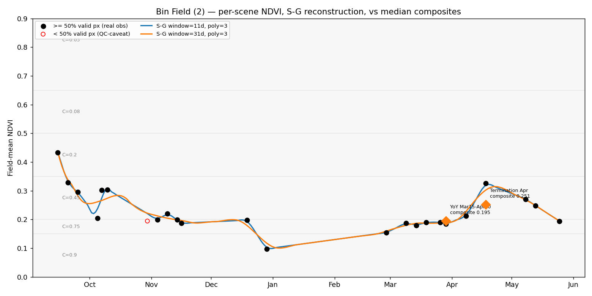

# Feasibility spike — Savitzky-Golay NDVI vs. median composite

**Field:** Bin Field (2), Shelby County IA — 48.6 ac (boundary `Bin Field (2).zip`, the same
loader `src/io_utils.load_boundary_file` the app uses)
**Season analyzed:** 2025-09-15 → 2026-05-31 (fall establishment → spring termination, 258 days)
**Data:** Sentinel-2 L2A (`COPERNICUS/S2_SR_HARMONIZED`) via Google Earth Engine, live pull
**Decision criterion:** do smoothed and composite land in the **same `IOWA_C_FACTOR_TABLE` bin?**
**Script:** [`spikes/savgol_ndvi_spike.py`](savgol_ndvi_spike.py) · **Run date:** 2026-09-17
**Status:** spike only — no change to `src/`, `app.py`, or the scoring pipeline.

> **Note on references.** The task pointed at "the existing GEE fetch logic in `sentinel_utils.py`."
> In this repo `sentinel_utils.py` is the CDSE/sentinelhub path; the **production GEE** fetch lives in
> `src/gee_ndvi_utils.py`. The spike reuses that one — its cloud definition (SCL classes 3/8/9/10/11),
> the `field_cloud_fraction < 0.30` scene filter, `NDVI = normalizedDifference(B8, B4)`, and the
> `median()` composite — so the comparison is against what actually runs.



---

## 1. Season time series — scene count, dates, valid-pixel fraction

One field-mean NDVI per acquisition (clear pixels only), with the per-scene valid-pixel fraction
(share of field pixels not flagged cloud/shadow/snow by SCL).

| Metric | Value |
|---|---|
| S-2 acquisitions intersecting the field | **59** |
| Fully cloud/snow-masked (0 % valid, NDVI = NaN) | 33 |
| **Usable field-mean NDVI (≥ 50 % valid px)** | **23** |
| Production-grade (field cloud/shadow < 30 %) | 22 |
| Nominal revisit | 5 days (S2A+S2B) |

**Usable observations by month** (field-mean NDVI):

| Month | Usable scenes | NDVI values |
|---|---|---|
| Sep 2025 | 3 | 0.432, 0.329, 0.296 |
| Oct 2025 | 3 | 0.204 (69 %), 0.303, 0.304 |
| Nov 2025 | 4 | 0.200, 0.220, 0.198, 0.187 |
| Dec 2025 | 2 | 0.198, **0.098** (outlier) |
| Jan 2026 | **0** | — (all cloud/snow) |
| Feb 2026 | 1 | 0.154 (87 %) |
| Mar 2026 | 5 | 0.188, 0.180, 0.190, 0.190, 0.184 |
| Apr 2026 | 2 | 0.212, 0.326 (75 %) |
| May 2026 | 3 | 0.271, 0.248, 0.194 |

Valid-pixel fraction of usable scenes is ≈ 1.00 for most; the lowest kept are 0.69 (Oct 5),
0.75 (Apr 18), 0.87 (Feb 27). Full per-scene table: [`output/bin_field_scenes.csv`](output/bin_field_scenes.csv).

This is a **weak / marginal** cover crop: spring NDVI sits at 0.18–0.25, straddling the
`[0.15,0.20)` and `[0.20,0.35)` C-bins — i.e. right on the boundaries, which makes it a
**stringent** test for bin agreement, not a soft one.

---

## 2. Agreement — do smoothed and composite land in the same C-factor bin?

Composites replicate production exactly (`field_cloud_fraction < 0.30`, `CLOUDY_PIXEL_PERCENTAGE < 80`,
`median()`, field-mean over the true polygon). The **effective date** is the median of the
contributing scene dates; the S-G curve is read at that date.

| Composite window | Scenes | Composite NDVI | Composite bin → C | S-G NDVI (8-param range) | S-G bin → C | **Same bin?** |
|---|---|---|---|---|---|---|
| YoY Mar 15–Apr 20 | 15 | **0.195** | `[0.15,0.20)` → 0.75 | 0.187–0.189 | `[0.15,0.20)` → 0.75 | ✅ **yes** |
| Termination Apr 1–May 1 | 6 | **0.251** | `[0.20,0.35)` → 0.45 | 0.294–0.319 | `[0.20,0.35)` → 0.45 | ✅ **yes** |

The Termination composite (0.251) reproduces the **exact number in the existing 45Z package**
for this field, so this is the real production case, not a synthetic one.

**On the bin criterion: they agree in both windows.** But two things sit underneath that "yes":

1. **The bin boundary is the fragile part, and both methods sit on it together.** The YoY
   composite is 0.195 — 5 thousandths below the 0.20 line that separates C = 0.75 from C = 0.45
   (a 0.30 absolute C step). S-G agrees it's just under (0.187–0.189), but "agreement" here means
   *both are balanced on the same knife-edge*, not that the estimate is robust. Any 6-point NDVI
   nudge flips the bin for either method.

2. **Bin agreement hides a real divergence in production's actual C model.** `_lookup_c_factor`
   (the bin table) is deprecated in `scoring.py`; production scores with the **continuous**
   `_continuous_c_factor` (exponential). Re-scored through that model:

   | Window | Composite NDVI → C_cont | S-G NDVI → C_cont | ΔC_cont |
   |---|---|---|---|
   | YoY | 0.195 → 0.433 | 0.188 → 0.445 | +0.012 (+3 %) |
   | Termination | 0.251 → **0.352** | 0.302 → **0.295** | **−0.057 (−16 %)** |

   At green-up the **median composite understates the peak**: it blends the whole Apr 1–May 1
   window (including the Apr 8 = 0.212 scene) and medians down to 0.251, while S-G tracks the
   local green-up and reads ~0.30 at Apr 18. Same bin, but a **~16 % lower continuous C-factor**,
   which flows linearly into soil-loss A = R·K·LS·C. Direction is systematic (S-G ≥ composite at
   green-up), so on a stronger field near the 0.35/0.50 breaks it *could* cross a bin.

---

## 3. Savitzky-Golay parameter sensitivity

Grid: window ∈ {11, 21, 31, 41} days × polyorder ∈ {2, 3}, evaluated at both composite dates.

- **C-factor bin never changes** across all 8 combinations at either window.
- **polyorder (2 vs 3) is inert** here — identical to 3 decimals. At day-scale windows over a
  slow NDVI curve, quadratic vs cubic makes no difference.
- **Window length is the only lever**, and only at green-up: the Apr-18 estimate slides from
  **0.319 (w=11) → 0.294 (w=41)** as the window widens and pulls the point toward the seasonal
  mean — i.e. a longer window makes S-G behave more like the composite. NDVI spread 0.025; still
  one bin. At the flat YoY date the spread is 0.002.
- **Outlier control is a window-length effect** (visible in the plot): the Dec-29 single-scene
  0.098 dip is tracked by w=11 and damped by w≥31. None of the scored dates touch it.

Per-day reconstructions for every parameter set: [`output/bin_field_daily.csv`](output/bin_field_daily.csv).

---

## 4. Failure modes — how far can the fill go before it's indefensible?

Every daily value carries `gap_days_to_obs` = distance to the nearest **real** observation.
That is the glass-box honesty metric: a smoothed value 3 days from a real scene is measurement;
30 days out it is mostly model.

- **Cloud-gap win (the point of the spike).** Narrow window **Apr 10–17 returns 0
  production-grade scenes** — today the pipeline emits nothing here and raises a QC caveat.
  S-G returns **NDVI ≈ 0.27 (C-bin `[0.20,0.35)`, C_cont ≈ 0.33)**, bracketed by real
  observations Apr 8 (0.212) and Apr 18 (0.326), with the **nearest real obs 5 days away** (~1
  revisit). That is a defensible, fully-traceable value where the composite has none.
- **Worst gaps.** Longest stretch between usable scenes is **60 days** (Dec 29 → Feb 27, deep
  winter — cloud + snow SCL-masking, zero usable January scenes), giving a worst interpolation
  distance of **30 days**. That interior is a straight line between two real points (linear fill,
  no polynomial support), but it falls in dormancy when NDVI is flat and **not** in any scored
  window, so consequence is low.
- **Growth-phase gaps** (where it matters) top out at 10 days (Apr 8 → Apr 18) → ≤ 5 days from a
  real obs at the midpoint.

**Rule of thumb for a glass-box 45Z context:**

> Trust a smoothed NDVI only when the **nearest real observation is ≤ ~10 days (≤ 2 Sentinel-2
> revisits)** *during an actively changing phase* (green-up / senescence). 10–20 days → usable
> but must be disclosed as interpolated. **> ~20 days in a changing phase → do not let it anchor a
> C-factor.** Dormancy (flat NDVI) tolerates longer gaps but isn't scored anyway. Operationally:
> attach `gap_days_to_obs` to every value and gate scoring at ≤ 10 days. Bin Field's spring
> reconstruction never exceeds 5 days, so it clears the gate everywhere it's scored.

---

## 5. Verdict — **BUILD**, scoped as a gap-fill fallback with a distance gate

The feasibility question is answered on Bin Field (2):

- **Same C-bin in both production windows**, including the exact 0.251 case already in the 45Z
  package. ✅
- **Survives the cloud gap:** produces a defensible, glass-box NDVI (0.27, 5-day interpolation,
  every value traceable to real obs + stated linear-fill + stated local polynomial) in a
  0-scene window where the composite currently fails. ✅
- **Parameter-robust:** bin is invariant to window/polyorder; polyorder is inert. ✅

**Build it as a QC-gap fallback, not a composite replacement**, with two guardrails and one
open validation item:

1. **Gate on `gap_days_to_obs ≤ 10`** for any date used in scoring; surface the distance in the
   report so a verifier sees exactly how much is measurement vs. filter.
2. **Keep the composite as primary** where it has scenes; use S-G only to populate windows the
   composite can't (the 0-scene / <50 %-valid cases that trigger today's caveats).
3. **Resolve before wider rollout:** the bin test passes, but production's continuous C model
   shows S-G reading **~16 % lower C at green-up** because the median composite understates the
   peak. This is a genuine, directional divergence — reported straight, not tuned away.
   Validate on a **higher-biomass field (NDVI 0.35–0.55)** where that 16 % could cross a bin or
   steepen continuous-C, and decide which estimator is *correct* at green-up (the point-in-time
   S-G is arguably the better physical estimate of stand on a given date; the median is a
   window average). That decision — not the smoothing mechanics — is what gates promoting S-G
   from fallback to primary.

### Reproduce

```bash
python spikes/savgol_ndvi_spike.py
```

Requires the system Python interpreter (has `earthengine-api`; the `.venv` does not) and the
existing `[gee]` credentials in `.streamlit/secrets.toml`. scipy is **not** used — S-G is a
pure-numpy local-least-squares fit (`savgol_glassbox`), which is both self-contained and, for the
glass-box mandate, more transparent than a library call.
